# google-weather-icons

## Icons

- There are four distinct themes, `v1`, `v2`, `v3` and `flat`.
- Naming for specific icons differs between these sets. File names are based on their cdn name.

### [/icons/weather/v0/](./icons/weather/v0),  [/icons/weather/v1/](./icons/weather/v1)

- Icons from the new GSA Weather Experience (Hyla Weather Immersive), available on throughout most Google experiences (GWS, Pixel Weather, Pixel Launcher, etc.)
- Available in Light/Dark mode styles.
- v0 is **the most comprehensive** set. v1 is missing the `mixed_rain_hail_sleet` icon.

#### Light

        [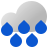](./icons/weather/v0/light/heavy_rain.svg) [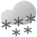](./icons/weather/v0/light/heavy_snow.svg)              [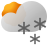](./icons/weather/v0/light/scattered_snow_showers_day.svg) [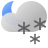](./icons/weather/v0/light/scattered_snow_showers_night.svg)   [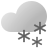](./icons/weather/v0/light/snow_showers_snow.svg)    [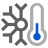](./icons/weather/v0/light/very_cold.svg)   

#### Dark

      [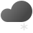](./icons/weather/v0/dark/flurries.svg)  [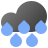](./icons/weather/v0/dark/heavy_rain.svg) [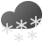](./icons/weather/v0/dark/heavy_snow.svg)            [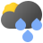](./icons/weather/v0/dark/scattered_showers_day.svg)  [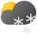](./icons/weather/v0/dark/scattered_snow_showers_day.svg) [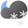](./icons/weather/v0/dark/scattered_snow_showers_night.svg) [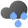](./icons/weather/v0/dark/showers_rain.svg)  [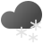](./icons/weather/v0/dark/snow_showers_snow.svg)       [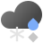](./icons/weather/v0/dark/wintry_mix_rain_snow.svg)

#### Regional Forecasting

- Some regions (Japan, South Korea) have limited forecasting data available, which uses the following icons.

     [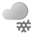](./icons/weather/v0/light/cloudy_with_snow.svg)   [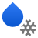](./icons/weather/v0/light/rain_with_snow.svg) [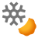](./icons/weather/v0/light/snow_with_clear.svg)  

     [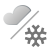](./icons/weather/v0/light/cloudy_then_snow.svg)    [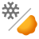](./icons/weather/v0/light/snow_then_clear.svg) [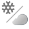](./icons/weather/v0/light/snow_then_cloudy.svg) [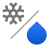](./icons/weather/v0/light/snow_then_rain.svg)

    [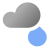](./icons/weather/v0/dark/cloudy_with_rain.svg) [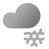](./icons/weather/v0/dark/cloudy_with_snow.svg)  [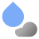](./icons/weather/v0/dark/rain_with_cloudy.svg) [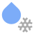](./icons/weather/v0/dark/rain_with_snow.svg)   [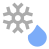](./icons/weather/v0/dark/snow_with_rain.svg)

    [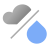](./icons/weather/v0/dark/cloudy_then_rain.svg)      [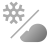](./icons/weather/v0/dark/snow_then_cloudy.svg) [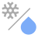](./icons/weather/v0/dark/snow_then_rain.svg)

### [/icons/weather/flat/](./icons/weather/flat/)

- Icons from the [Clock](https://play.google.com/store/apps/details?id=com.google.android.deskclock) app
- New weather icons (v0, v1) in a flat style that uses less 3D-looking gradients

#### Iconset

        [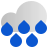](./icons/weather/flat/heavy_rain.svg)                [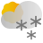](./icons/weather/flat/scattered_snow_showers_day.svg) [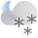](./icons/weather/flat/scattered_snow_showers_night.svg)         

### [/icons/weather/v2/](./icons/weather/v2),  [/icons/weather/v2/](./icons/weather/v2)

- High contract iconset, used in the Weather app for Pixel.
- **NOTE:** This set is missing the `mixed_rain_hail_sleet` icon. I'm unsure if this icon still exists or got fully supplemented by `wintry_mix`.

#### Light

     [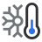](./icons/weather/v2/light/cold.svg) [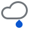](./icons/weather/v2/light/drizzle.svg)    [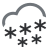](./icons/weather/v2/light/heavy_snow.svg)                [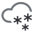](./icons/weather/v2/light/snow_showers.svg)       

#### Dark

          [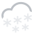](./icons/weather/v2/dark/heavy_snow.svg)                       

### [/icons/weather/v3/](./icons/weather/v3),  [/icons/weather/v3/](./icons/weather/v3)

- Experimental iconset, mixing the v1 and v2 style. Currently not used in any products.
- Unlike v2, this one features full support for regional forecasting icons.
- **NOTE:** This set is missing the `blizzard` and `thunderstorms` icons.

#### Light

    [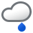](./icons/weather/v3/light/drizzle.svg)   [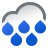](./icons/weather/v3/light/heavy_rain.svg) [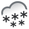](./icons/weather/v3/light/heavy_snow.svg)            [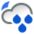](./icons/weather/v3/light/scattered_rain_showers_night.svg) [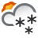](./icons/weather/v3/light/scattered_snow_showers_day.svg) [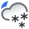](./icons/weather/v3/light/scattered_snow_showers_night.svg)  [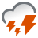](./icons/weather/v3/light/strong_thunderstorms.svg)  [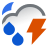](./icons/weather/v3/light/thunderstorms_night.svg)     

#### Dark

    [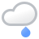](./icons/weather/v3/dark/drizzle.svg)   [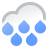](./icons/weather/v3/dark/heavy_rain.svg) [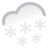](./icons/weather/v3/dark/heavy_snow.svg)          [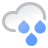](./icons/weather/v3/dark/rain_showers.svg)             

#### Regional Forecasting

- Some regions (Japan, South Korea) have limited forecasting data available, which uses the following icons.

           

           

           

           

### [/icons/google_news/](./icons/google_news/)

- Icons from [Google News](https://news.google.com) web.
- In Lottie animation format, set is very incomplete.

## Weather Frog

### [/froggie/v1/landscape](./froggie/v1/landscape), [/froggie/v1/portrait](./froggie/v1/portrait)

- Google Weather Frog, used by GSA Web Search.

#### Portrait

#### Landscape

### [/froggie/v2/](./froggie/v2/)

- Google Weather Frog, used by the new GSA Weather Experience (Hyla Weather Immersive).
- Has some new images compared to v1.
- v2 images are wider/have a larger visible content area.

#### Mobile

#### Tablet

### [/froggie/v1/square](./froggie/v1/square)

- Google Weather Frog, used by the old mobile weather experience and widgets.
- Each asset also exists as separate background, midground and foreground layer sprites.

   

### [/froggie/hubui](./froggie/hubui)

- Background images for the Pixel Tablet weather frog screensaver (HubUI), the frog animations themselves are stored in the Flare (now named Rive) animation format and cannot be exported (to my knowledge).

#### Mushroom

    

#### Hill

    

#### Fields

    

## Lottie/Animations

### [/animated_weather/v1/mobile](./animated_weather/v1/mobile), [/animated_weather/v1/tablet](./animated_weather/v1/tablet)

- Used in GWS for Pixel Devices, atop/behind the froggie sprite.
- Lottie JSON Format.

### [/animated_weather/v2/mobile](./animated_weather/v2/mobile), [/animated_weather/v2/tablet](./animated_weather/v2/tablet)

- Used in the new GSA Weather Experience (Hyla Weather Immersive), atop/behind the froggie sprite.
- dotlottie Format.
- v1 and v2 are (to my knowledge) identical in terms of content.

### [/animated_weather/v3/mobile](./animated_weather/v3/mobile), [/animated_weather/v3/tablet](./animated_weather/v3/tablet)

- Referenced in GWS, unsure what the difference between v1 and v3 is.
- Lottie JSON Format.

### [/other/lottie/weather_details](./other/lottie/weather_details)

- Various animations from the new GSA Weather Experience (Hyla Weather Immersive).

### [/other/lottie/pixel_weather](./other/lottie/pixel_weather)

- Used in the background of the Pixel Weather app.